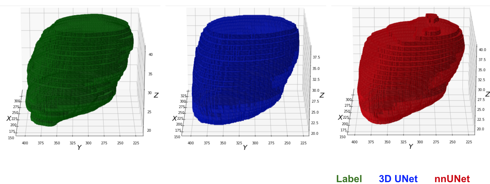

# Heart Transplant
Estimating size of the heart to determine the fit between donor's and patient's organs.

Preliminary task in progress: heart segmentation. 

Results example:




## Data 

We used open NLST dataset - [link](https://wiki.cancerimagingarchive.net/display/NLST/National+Lung+Screening+Trial). 
Full database contains 26,254 patients with CT exams to screen for lung cancer.

We are using `60 patients` with raw CT scans and corresponding labeled contour masks.  
The masks were labelled by an expert using 3D Slicer and saved in NIFTI format. 

Our data split is `42` patients for training, `9` for validation, and `9` for test.


### Preprocessing
We save all DICOM series files into NIFTI format. 

Our pre-processing steps include:
1. Reading DICOM series into a single object          Use Pydicom

2. Conversion to Hounsfield units

3. Resampling slice thickness -  https://vincentblog.xyz/posts/medical-images-in-python-computed-tomography 

4. Resizing to desired size

5. Padding in Z dimension


## Methodology

Document with the analysis of related works - [link](https://docs.google.com/document/d/1YFRnelMWPKvXbVeAvGqLbOmTHGysmeLhuZ2P8RffkGo/edit?usp=sharing).

We use 3D UNet, and nn-UNet for most of our experiments. 

For nn-Unet experiments, we fork the official [nn-UNet](https://github.com/MIC-DKFZ/nnUNet) library.

We performed experiments comparing both of these models on 2d sliced data, 2.5d and 3d volumes. The best performance was achieved with 3d dimensionality.

## Usage


We use [MONAI](https://monai.io/) - a PyTorch-based, open-source framework for deep learning in healthcare imaging. 
It provides flexible pre-processing for multi-dimensional medical imaging data, domain-specific implementations for networks, losses, evaluation metrics, and 
multi-GPU data parallelism support.

We also use [Pytorch Lightning](https://www.pytorchlightning.ai/index.html) - the deep Learning framework to train, deploy, and ship AI products Lightning fast.
It provides us the following functionality:
* Logging, metrics, visualization
* Model checkpointing
* Early stopping
* Performance & bottleneck profiler
* Mixed precision training

Hierarchy of this repository:
```
├── config
    ├── config.yaml
    ├── config_2_5d.yaml
    ├── config_2d.yaml
    ├── config_reconstruct.yaml
├── data
    ├── aug.py
    ├── dataloader.py
    ├── dataset.py
├── inference
    └── weights
       └── ...
    ├── install_packages.sh
    ├── INSTRUCTIONS.md
    ├── run.py 
    ├── utils.py
├── models
    ├── loss.py
    ├── reconstruction.py   # for self-supervised pre-training
    ├── training_modules.py  # custom lightning trainers
├── utils  --additional tools 
├── evaluate,py
├── evaluate2d_per_patient.py
├── train.py
├── train_2_5d.py
├── train_2d.py
├── train_reconstruction.py
```


### Training
To train 3d UNet, please run `train.py`. It will read hyperparameters from the `config/config.yaml`. 
It can be used to change any of the parameters including path to data, `batch_size_per_gpu`, `target_size`, number of epochs,
loss, learning rate, etc.

### Postprocessing
We perform the following steps during postprocessing to improve the predicted masks:
1. Constraining the boundary for mask using the pre-calculated heart zone
2. Test time augmentation (for some models)
3. Connected Component Analysis


### Inference
To run inference code, refer to the [INSTRUCTIONS.md](inference/INSTRUCTIONS.md) that contains information about required dependencies
and instructions on running scripts.

To run the scripts directly:
```
python inference/run.py --scan_path <PATH_TO_DICOM_SERIES> --result_save <PATH_TO_SAVING>
```